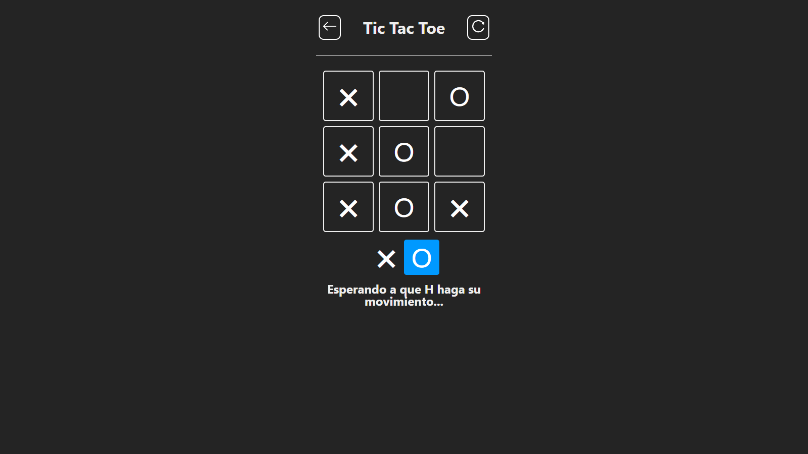

# Tic-Tac-Toe-Frontend

## Description

Tic Tac Toe game developed with React.js, Node.js, Express.js and Socket.io. This project use socket.io for the real time game and MongoDB for the database.

## Screenshots

## Features

-   Instantly response and request with socket.io
-   Fully responsive with all devices
-   Real time game
-   Multiplayer game

## Technologies

-   [React.js](https://reactjs.org/): A JavaScript library for building user interfaces.
-   [Node.js](https://nodejs.org/en/): A JavaScript runtime built on Chrome's V8 JavaScript engine.
-   [Express.js](https://expressjs.com/): A minimal and flexible Node.js web application framework.
-   [Socket.io](https://socket.io/): A JavaScript library for realtime web applications.
-   [MongoDB](https://www.mongodb.com/): A document-oriented NoSQL database used for high volume data storage.

## Deployment

[Tic Tac Toe Multiplayer](https://tic-tac-toe-ctm.pages.dev)
